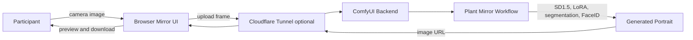
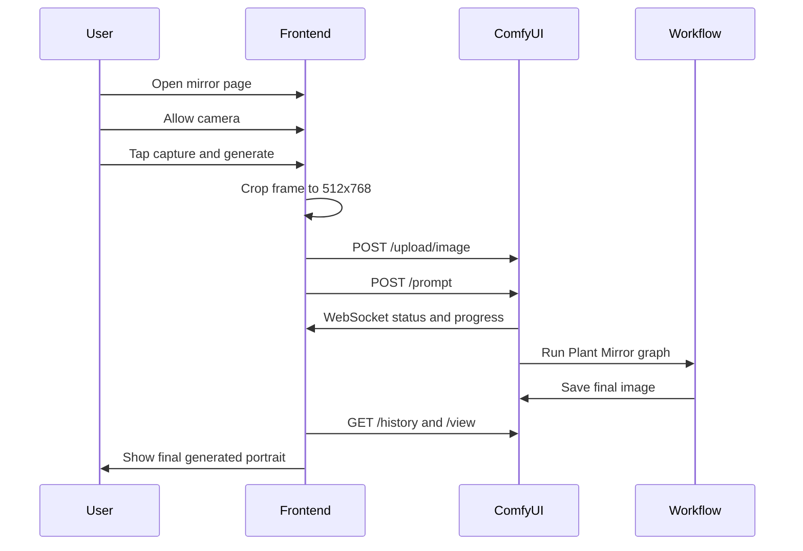
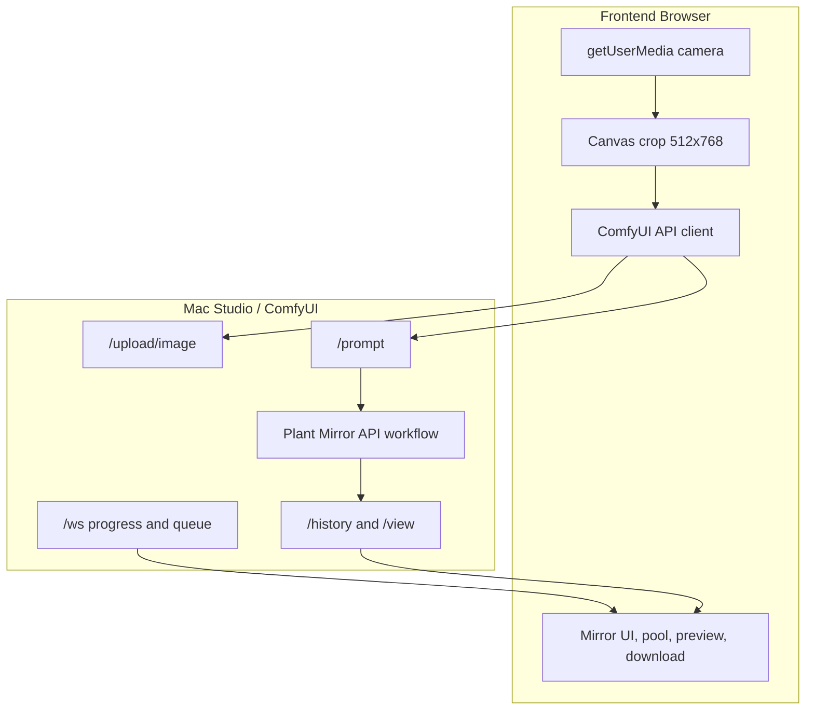

# unstable mirror

**unstable mirror** is an interactive AI portrait system: a browser becomes a mirror, a camera becomes the input, and a ComfyUI pipeline transforms the person in front of it into a strange botanical reflection.

The project began with a simple question: what if a portrait booth did not just take your picture, but returned a version of you that looked alive, unstable, and overgrown? The final system is built as a two-machine workflow: a lightweight front-end device captures and displays the participant, while a stronger generation machine runs the image pipeline.

## Final Result

Open the public interface:

`https://unstablemirror.pages.dev`

When the backend tunnel is running, any phone, tablet, or laptop can open the page, allow camera access, capture a portrait, wait in the generation queue, and receive a transformed image. The generated result appears in the **pool**. Tap or click it to enlarge it, then download the image.

The current public frontend is intentionally clean: no visible settings panel, mobile-first controls, queue count, progress feedback, a result preview modal, and a download button.

## The Idea

The mirror is designed to feel like a live ritual instead of a normal image generator. A person stands in front of a camera. The system captures a portrait, isolates the subject, preserves enough identity to keep the image personal, then pushes the face and body into a surreal plant-like transformation.

The visual language is:

- botanical growth
- mushrooms and translucent organic structures
- flowers merging with skin
- face identity preserved through IPAdapter FaceID
- a dark mirror interface with a small generated-image pool
- real-time or semi-real-time pacing, depending on generation speed

## System At A Glance



For local installation use, the browser can talk directly to the ComfyUI server over LAN. For public demos, Cloudflare Pages hosts the frontend and Cloudflare Tunnel temporarily exposes the ComfyUI backend over HTTPS.

## Interaction Flow



## Visual Storyboard

```text
1. The Mirror
   A full-screen camera view fills the browser. The participant sees themselves
   framed by a dark glass interface.

2. The Capture
   A flash confirms the portrait was taken. The frontend crops the image into a
   portrait ratio for the ComfyUI graph.

3. The Waiting Pool
   The UI shows progress and queue depth while ComfyUI runs the generation.

4. The Return
   The final portrait appears in a small pool beside or above the mirror.

5. The Artifact
   The participant taps the pool, enlarges the image, and downloads the result.
```

## How It Developed

The first version was only the technical bridge: camera capture in the browser, image upload to ComfyUI, and a return path for the generated image. The MacBook acted as the camera/display device and the Mac Studio handled generation.

The next challenge was making the ComfyUI graph reliable through the API. The original `Plant_Mirror.json` was a UI workflow, so it had to be converted into API format. The live camera frame is injected into node `19`, which was simplified to a standard `LoadImage` node. The final output is pulled from node `31`, the `SaveImage` node, so the frontend does not accidentally show an intermediate segmentation preview.

The interface then became more like an installation piece. The camera view became a mirror. The result moved into a separate pool. Progress, queue depth, mobile layout, a preview modal, and download behavior were added so the system could work for participants on many devices.

Finally, the project was deployed publicly. Cloudflare Pages hosts the frontend. A temporary Cloudflare Tunnel can expose the ComfyUI backend when the Mac Studio is running. This makes the mirror accessible from anywhere while keeping the heavy AI process on the local machine.

## Architecture



## ComfyUI Workflow

The workflow uses:

- `CheckpointLoaderSimple` with `v1-5-pruned-emaonly.safetensors`
- `LoraLoaderModelOnly` with `ZFCWBK4A0E4E052C66J5CY6T20.safetensors`
- `ClothesSegment` from `ComfyUI-RMBG`
- `AILab_Preview` from `ComfyUI-RMBG`
- `IPAdapterUnifiedLoaderFaceID`
- `IPAdapterAdvanced`
- `KSampler`
- `VAEDecode`
- `SaveImage`

The runtime patch is intentionally small:

- node `19`: replace `inputs.image` with the freshly uploaded camera frame
- node `29`: randomize `inputs.seed`
- node `31`: read the final generated image from `SaveImage`

The FaceID provider is currently set to `CPU` in the API workflow. This avoids a CoreML ONNX Runtime shape error that appeared during public testing.

## Repository Structure

```text
unstableMirror/
  frontend/
    index.html
    src/
      main.ts
      comfy.ts
      style.css
      workflow.json
  workflows/
    Plant_Mirror.ui.json
    plant_mirror.api.json
  scripts/
    setup_backend.sh
    setup_backend_cuda.sh
    ui_to_api.py
  models/
    loras/
      ZFCWBK4A0E4E052C66J5CY6T20.safetensors
```

## Frontend Features

- Vite + vanilla TypeScript
- responsive desktop and mobile layouts
- full-screen mobile camera mode
- safe-area support for phones with notches and home indicators
- queue depth display from ComfyUI WebSocket status
- generation progress bar
- single-flight loop mode so the frontend does not spam the ComfyUI queue
- result pool
- tap/click to enlarge generated images
- download button for the latest result
- hidden settings panel for a cleaner public installation UI

## Public Demo Mode

The deployed page is:

`https://unstablemirror.pages.dev`

The frontend only works as a public AI mirror when the backend is reachable. During a demo, start ComfyUI on the Mac Studio and expose it with a Cloudflare Tunnel.

```bash
cloudflared tunnel --url http://127.0.0.1:8188 --no-autoupdate
```

Then rebuild/deploy the frontend with the generated tunnel URL:

```bash
cd frontend
VITE_COMFY_BASE_URL=https://YOUR-TUNNEL.trycloudflare.com npm run build
npx wrangler pages deploy dist --project-name unstablemirror --branch main
```

Temporary tunnel URLs stop working when `cloudflared` stops. The Pages site can remain online, but generation will fail until a backend tunnel is running again.

## Local Mac Studio Backend

The Mac Studio runs ComfyUI and exposes the API:

```bash
cd /path/to/ComfyUI
python main.py \
  --listen 0.0.0.0 \
  --port 8188 \
  --enable-cors-header "*"
```

For the ComfyUI Desktop app on macOS, the working launch can look like this:

```bash
cd /Applications/ComfyUI.app/Contents/Resources/ComfyUI
/Users/yhr/Documents/ComfyUI/.venv/bin/python main.py \
  --listen 0.0.0.0 \
  --port 8188 \
  --enable-cors-header "*" \
  --base-directory /Users/yhr/Documents/ComfyUI \
  --user-directory /Users/yhr/Documents/ComfyUI/user \
  --input-directory /Users/yhr/Documents/ComfyUI/input \
  --output-directory /Users/yhr/Documents/ComfyUI/output \
  --temp-directory /Users/yhr/Documents/ComfyUI/temp \
  --front-end-root /Applications/ComfyUI.app/Contents/Resources/ComfyUI/web_custom_versions/desktop_app \
  --disable-auto-launch
```

Confirm it is reachable:

```bash
curl http://127.0.0.1:8188/system_stats
```

## Fresh Backend Setup

If setting up a new ComfyUI machine, use one of the setup scripts after cloning this repo and activating the ComfyUI Python environment:

```bash
# Apple Silicon / CPU / CoreML-oriented setup
scripts/setup_backend.sh /path/to/ComfyUI

# NVIDIA / CUDA setup
scripts/setup_backend_cuda.sh /path/to/ComfyUI
```

The scripts install the required custom nodes, copy the LoRA into place, and download the checkpoint/IPAdapter/RMBG/InsightFace assets needed by the graph.

## Frontend Development

```bash
cd frontend
npm install
VITE_COMFY_BASE_URL=http://127.0.0.1:8188 npm run dev -- --host
```

For local webcam use, open the frontend at:

`http://localhost:5173`

Browsers treat `localhost` as a secure context, so camera access works. Plain LAN HTTP addresses may not expose webcam APIs on mobile browsers.

## Updating The Workflow

If the ComfyUI graph changes:

1. Save the editable UI workflow as `workflows/Plant_Mirror.ui.json`.
2. Export API format from ComfyUI, or run:

```bash
python scripts/ui_to_api.py \
  workflows/Plant_Mirror.ui.json \
  workflows/plant_mirror.api.json \
  --swap-load-image 19
cp workflows/plant_mirror.api.json frontend/src/workflow.json
```

3. Verify that node `19` is `LoadImage`.
4. Verify that node `31` is the final `SaveImage` output.
5. Rebuild and redeploy the frontend.

## Troubleshooting

- **The frontend loads but generation fails:** the ComfyUI backend or Cloudflare Tunnel is not running.
- **Camera is unavailable:** open the app over HTTPS or `localhost`; browsers restrict camera access on insecure origins.
- **Only a cutout/segmentation image appears:** make sure the frontend reads output images from node `31`, not the first history output.
- **CoreML ONNX Runtime shape error:** use `"provider": "CPU"` for `IPAdapterUnifiedLoaderFaceID`.
- **Queue never moves:** ComfyUI may be busy, crashed, or blocked by a model download.
- **CORS errors:** start ComfyUI with `--enable-cors-header "*"`, or use the exact frontend origin.

## Final Reflection

The project started as an experiment in connecting a live camera to a local AI image generator. It became a small installation system: part mirror, part portrait booth, part generative ritual. The most important shift was treating the frontend not as a control panel, but as the artwork's surface. The controls became minimal. The settings disappeared. The generated image became something you retrieve from a pool.

The final result is a portable interactive portrait system that can run locally between two machines or be opened publicly through Cloudflare, while still keeping the heaviest AI work on the Mac Studio.

## License

No license declared.
